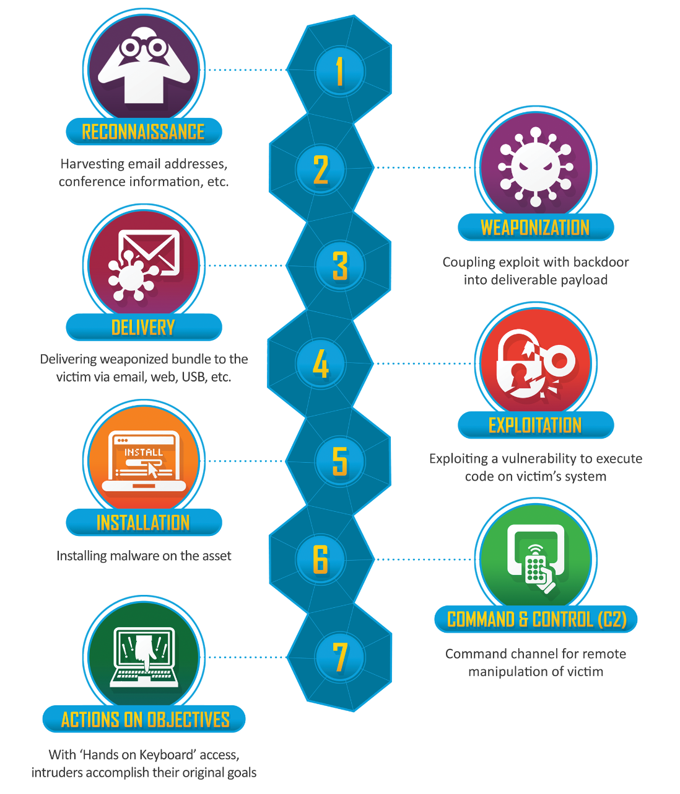

# Concept of Cyber Kill Chain- Attack & Defend (Lockheed Martin)

- The concept of `Kill Chain` is used by the US military to define steps to lunch a successful attack

# Cyber Kill Chain

# Reconnaissance

## Attack 

- Passive Recon
	- Google Hacking
	- Company Wesite
	- Social Media (Facebook, Twitter, Linkedin)
- Active Recon
	- Nmap
	- Host and Port Scanning
	- Vulnerability Scanning

## Defend

#### Defend against Passive Recon
- Limit Public Information
- Limit Social Media Usage or post
- Training user on all form of social engineering attacks such as phishing

#### Defend aganist Active Recon
- Disable unused ports/service
- firewall 
- Antiviurs
- Honeypots

## Case -1 

- Ko Bob သည်အာဏာသိမ်းပြီးနောက် NUG ရဲ့ Ministry တစ်ခုမှာကူညီလုပ်ကိုင်ပေးနေသူတစ်ယောက်ဖြစ်လာသည်။ သူသည် Online မှာ Funding ရှာဖွေပေးရန်အတွက် တာဝန်ယူထားသူတစ်ယောက်ဖြစ်ပြီး သူဖုန်းနံပါတ်တစ်ခုကို Funding ရှာဖွေသော Page တစ်ခုတွင်ဆက်သွယ်ရန်ဖုန်းအဖြစ်ထား ထားထားသည်။ သူဖုန်းနံပါတ်မှာ `+959778206233` ဖြစ်သည်။
Passive Recon နည်းဖြင့် သူ့အကြောင်းကို မည်သို့စုံစမ်းနိုင်သနည်း

`site:facebook.com intext:"959778206233" OR intext:"+959778206233" OR intext:"09778206233"`

# Weaponization

## Attack

- Exploit-db
- Social Engineering Toolkit
- SQLmap
- owasp top 10 vulnerability exploit

## Defend

- Disable office marcos
- Always update system
- Checking Email before opening
- Checking Email attachment

# Delivery

## Attack

- Client Side
	- end-user need to interact
	- inserting USB, Email Phishing
	- Social Engineering
- service side
	- rare , but possible at this time
	- Israel spy tech company participate (ISP in Myanmar???)
- supply chain 
	- Inplant deeply targeted organization and wide range of target
	- 2018, Bloomberg report, Big Hack

## Famous Supply chain attack

2018, China Comparimize 1000 of computer (Server) located in Data center (Amazon, Apple) with the motherboard of server (produce by `supermicro` company)

- This chip can change the kernal of the computer and create opening for malware

## Defend

- Email Analysis
- Check file DNA (signature-base virus detection)
- Check virus for attachment send by unfamiliar email
- Disable USB port 
- anti-malware 
- limit the user to download and install software programs

# Exploitation

## Attack 

- Known Vulnerability Exploit
- SQL injection
- Client Side attacks using social Enigeering (CSRF, XSS)
- Viurs and Malware

## Defend

- Keep System update
- Anti-exploit or anti-virus
- Key anti-virus update

# Installation

## Attack

- Disable Antivirus and Download offensive tools

- Offensive Tools:
	- Meterpreter
	- Remote Access Tools (RAT)
	- Registary Change
	- Power Shell command
	- Ramsomware

- Privilage Escalation

## Defend 

- Limit user Privilege and Separatino user privilage

- Implementing strong passwords and enforcing password chages per time

- Mointor unusual process

- Alert the organization and Reversing

- Emergency Response
	- changing credential
	- isloate the computer from network
	- If required
- Remediation 
	- Restore and Recover

# Command and cotrol

## Attack

- Metasploit Framework
- cobaltstrike

## Defend

- Application Layer (layer-7) Firewall
- Network Segmentaion
- Block Malicious website 

# Action on Objective

- Financial
- Political
- Espionage
- Lateral or vertical movement (privilage escalation)

## Defend

- Data Leakage preventaion
- Data Backup

# More Comprehensive Framework

## MITRE ATT&CK

[MITRE ATT&CK](https://attack.mitre.org/)